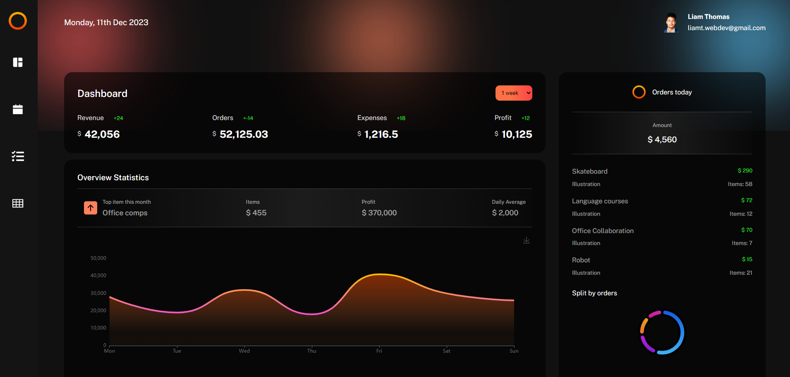

# React Admin Dashboard
### [Live Site](https://liamt-react-dashboard-one.vercel.app)

## Overview

This is a powerful and feature-rich React Admin Dashboard with charts, a calendar, tables, and a Kanban Trello board Todo App.

## Features

- Interactive Charts
- Calendar for Scheduling
- Data Tables
- Kanban Trello Board Todo App
- Responsive UI

## What you can do

- Add events in the Calendar by simply clicking on the timeslot you prefer
- Remove events by simply clicking on the event you do not need anymore
- Search for information on specific individuals and their locations within the dashboard
- Add new tasks for you or your team
